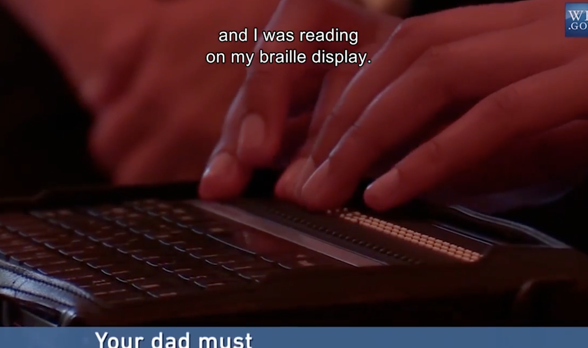
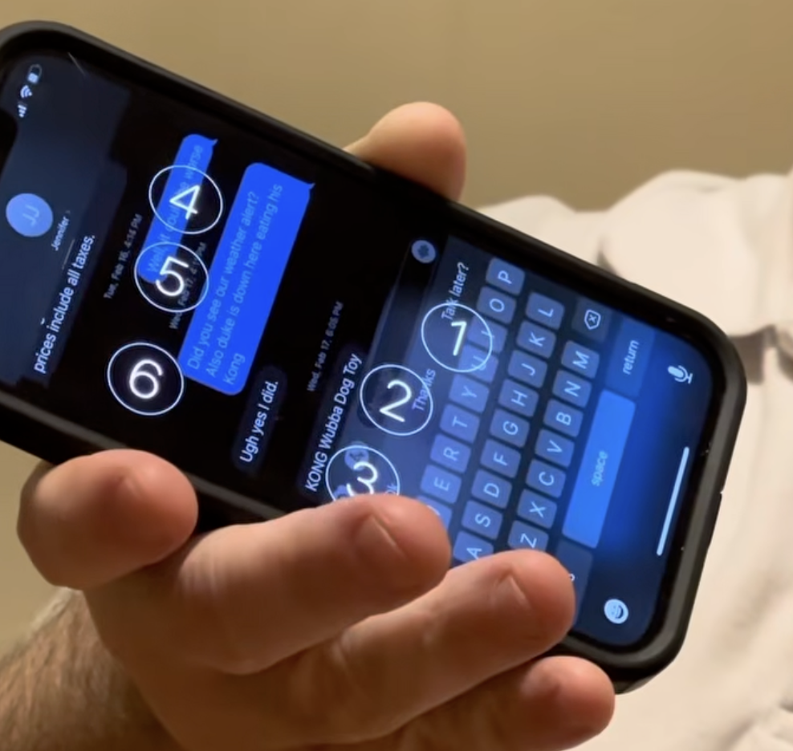

# §0.1: Input & Perception Methods

## How People Perceive Content

| Method | Example |
|--|--|
| Visual Perception | Screen, Graphical Interface |
| Auditory Perception | Screen Reader, Siri, Dictation, Voice Mode |
| Tactile Perception | Braille Readers, Haptics/Vibration |

Braille Display: https://youtu.be/Sl0iV7VyqN0?si=s4w03hVeSxuQ8qub

## How People Input Content

| Method | Example |
|--|--|
| Visual Input | Eye Tracking |
| Speech Input | Voice Control, Siri, Dictation, Voice Mode |
| Tactile Input | Keyboards, Pointer/Mouse, Braille Input |

Braille Input: https://www.youtube.com/shorts/46NHRVXBh-4 

## Mixing Perception with Input
* There's a difference between using a keyboard for navigation and using an screenreader:
    * screenreaders can be used with touch input, keyboard navigation, braille readers, eye control, and many other input methods.
    * keyboard navigation applies to both people that use screen readers and people who do not: have you ever clicked the `tab` key before while filling out a web form?